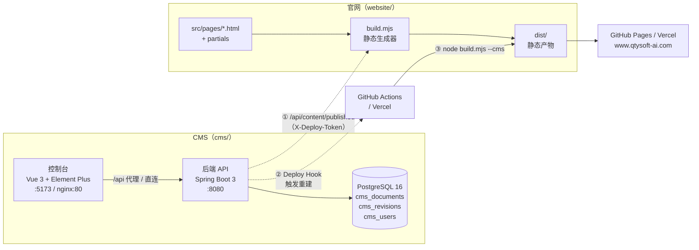

# 乾腾元官网 + CMS · 产品需求文档（PRD）

> **文档性质**：全系统统一 PRD，**基于当前代码实现逆向梳理（As-Built）**，描述的是"系统现在实际能做什么、怎么运作的"，而非早期设计意图。
> **版本**：v1.0　　**日期**：2026-09-04　　**代码基线**：`main` @ `d452875`
> **项目**：`qty-ai-site`（Git：`git@github.com:ICE55/qtysoft-ai-site.git`）

## 0. 文档关系与阅读指引

| 文档 | 位置 | 定位 | 状态 |
|---|---|---|---|
| **本文件（统一 PRD）** | `docs/PRD.md` | 官网 + CMS 全系统功能需求与业务规则，**以代码为准** | ✅ 现行 |
| 官网设计期 PRD | `website/docs/PRD.md` | 官网单体的早期设计稿 | 历史参考，与实现有出入 |
| 官网技术文档 | `website/docs/TECH.md` | 官网静态生成器的实现细节 | 有效 |
| CMS 设计期 PRD | `cms/docs/CMS-PRD.md` | CMS 早期设计稿 | 历史参考，与实现有出入 |
| CMS 技术文档 | `cms/docs/CMS-TECH.md` | CMS 架构与部署 | 有效 |

出现冲突时：**以本文件为准**（本文件逐行对照源码核过）。

---

## 1. 产品概述

### 1.1 背景

乾腾元（QTY AI）是一家企业级 AI Agent 全栈服务商。官网是其主要获客入口，承担"品牌可信度建立 → 能力说明 → 案例佐证 → 预约转化"的链路。

原有官网是纯手写静态页，业务同事改一个标题需要找研发改 HTML、提交、等部署。本次建设将官网升级为 **"静态站 + 轻量 CMS"** 的组合：

- **官网（website）**：保持零依赖静态站，SEO 友好、加载快、托管成本低；
- **CMS（cms）**：提供可视化后台，运营可自助改文案、发布、回滚，不需要碰代码和 Git。

### 1.2 产品定位

> **一处编辑，全站发布。** 用最低的运维复杂度，换来内容的自助运营能力。

设计取舍上的三条硬原则（决定了后面所有需求）：

1. **官网产物永远是静态 HTML** —— 不引入 SSR、不在运行时查数据库，保证性能与托管自由度；
2. **CMS 与官网解耦** —— 官网通过"构建期拉取已发布内容"消费 CMS 数据，CMS 挂了官网照样能用本地兜底内容构建；
3. **内容模型固定、Schema 驱动** —— 只做 6 个结构化文档，不做通用建站/自由排版，换取实现简洁与运营不易出错。

### 1.3 建设目标

| 目标 | 衡量方式 | 当前状态 |
|---|---|---|
| 运营可自助改官网文案，无需研发介入 | 从登录到线上生效 ≤ 5 分钟 | ✅ 已达成 |
| 内容变更可追溯、可回滚 | 每次发布生成版本快照，支持一键回滚 | ✅ 已达成 |
| 官网保持静态站的性能与 SEO 优势 | 纯静态产物，含 sitemap/OG/结构化数据 | ✅ 已达成 |
| 整套系统可一键起停 | `docker compose up -d` | ✅ 已达成 |
| CMS 不可用时官网仍能部署 | 构建自动回退本地 `content/*.json` | ✅ 已达成 |

### 1.4 范围边界

**本期已实现**：官网 6 个页面、6 份结构化内容文档、CMS 控制台（登录/仪表盘/编辑/预览/发布/历史回滚/账号管理）、Docker 整栈编排、GitHub Pages 自动部署。

**本期明确不做**：图片/媒体资源管理库、富文本编辑器（仅纯文本与多行文本）、多语言站点、多站点/多租户、定时发布、内容审批流、前台搜索、访问数据分析。

---

## 2. 系统总览

### 2.1 整体架构



### 2.2 三条运行时链路

| 链路 | 触发方式 | 数据流 |
|---|---|---|
| **内容生产** | 运营在控制台操作 | 浏览器 → 控制台 → `/api/content/*` → PostgreSQL |
| **内容消费** | 官网构建时 | `build.mjs --cms` → `GET /api/content/published` → 渲染进 HTML |
| **发布生效** | 控制台点"发布" | `publish()` → 写版本快照 → `DeployService.trigger()` → 部署钩子 → CI 重建 → 上线 |

### 2.3 技术栈

| 层 | 技术 | 版本 | 说明 |
|---|---|---|---|
| 官网构建 | Node.js + 自研 `build.mjs` | Node 20（CI） | **零第三方依赖**，仅用 Node 内置模块 |
| 官网前端 | 原生 HTML/CSS/JS | — | 无框架，3 个 CSS 文件（tokens / components / sections） |
| CMS 后端 | Spring Boot 3 + JPA + Security | 3.3.4 / Java 17 | JWT 无状态认证，BCrypt 密码 |
| CMS 数据库 | PostgreSQL | 16-alpine | `ddl-auto: update` 自动建表 |
| CMS 前端 | Vue 3 + Element Plus + Pinia + Vue Router | 3.5 / 2.8 / 2.2 / 4.4 | Vite 5 构建，Schema 驱动表单 |
| 部署 | Docker Compose / GitHub Actions / Vercel | — | 后端与控制台均有多阶段 Dockerfile |

### 2.4 代码规模与目录

```
qty-ai-site/
├── website/                 官网（静态站，2,179 行）
│   ├── build.mjs            静态生成器（模板引擎 + 内容注入，275 行）
│   ├── content/*.json       6 份本地兜底内容
│   ├── src/pages/*.html     6 个页面（frontmatter + 模板变量）
│   ├── src/partials/*.html  head / header / footer / cta-section
│   └── src/assets/          css（tokens/components/sections）+ js/main.js
├── cms/                     CMS（后端 1,639 行 + 控制台 1,104 行）
│   ├── backend/             Spring Boot（model / repository / service / web / security / config）
│   ├── console/             Vue 3 控制台（views / components / api / stores）
│   ├── docker-compose.yml   三服务编排（cms-db / cms-backend / cms-console）
│   └── .env.example         环境变量模板
├── docs/PRD.md              本文件
└── .github/workflows/       deploy.yml（GitHub Pages 自动部署）
```

---

## 3. 角色与权限

### 3.1 角色定义

| 角色 | 英文值 | 定位 | 数量预期 |
|---|---|---|---|
| 超级管理员 | `SUPER_ADMIN` | 全部内容权限 + 账号管理 + 触发重建 | 1–2 人 |
| 内容编辑 | `EDITOR` | 编辑并发布全部 6 份文档 | 运营/市场 |
| 只读 | `VIEWER` | 查看内容与历史，不能改 | 外部协作方 |

### 3.2 权限矩阵（后端 `@PreAuthorize` 强制，前端仅做菜单与路由收敛）

| 能力 | 接口 | SUPER_ADMIN | EDITOR | VIEWER | 未登录 |
|---|---|:--:|:--:|:--:|:--:|
| 登录 | `POST /api/auth/login` | ✅ | ✅ | ✅ | ✅ 公开 |
| 改自己密码 | `POST /api/auth/change-password` | ✅ | ✅ | ✅ | ❌ |
| 查看当前身份 | `GET /api/auth/me` | ✅ | ✅ | ✅ | ❌ |
| 查看内容概览 | `GET /api/content/summary` | ✅ | ✅ | ✅ | ❌ |
| 查看表单结构 | `GET /api/content/schema` | ✅ | ✅ | ✅ | ❌ |
| 读取草稿 | `GET /api/content/{key}` | ✅ | ✅ | ✅ | ❌ |
| 查看发布历史 | `GET /api/content/{key}/history` | ✅ | ✅ | ✅ | ❌ |
| **保存草稿** | `PUT /api/content/{key}` | ✅ | ✅ | ❌ | ❌ |
| **发布** | `POST /api/content/{key}/publish` | ✅ | ✅ | ❌ | ❌ |
| **回滚** | `POST /api/content/{key}/restore/{id}` | ✅ | ✅ | ❌ | ❌ |
| 账号增删改查 | `/api/system/users` | ✅ | ❌ | ❌ | ❌ |
| 手动触发重建 | `POST /api/system/deploy` | ✅ | ❌ | ❌ | ❌ |
| 拉取已发布内容 | `GET /api/content/published` | 部署令牌 | 部署令牌 | 部署令牌 | 部署令牌 |

> **认证机制**：用户名密码 → JWT（`Authorization: Bearer`），载荷含 `uid` 与 `role`，默认有效期 **120 分钟**，无状态（服务端不存 session）。
> **发布接口与登录令牌完全隔离**：`/api/content/published` 不认 JWT，只认 `X-Deploy-Token` 请求头。

### 3.3 账号相关业务规则

| 规则 | 实现 |
|---|---|
| 首次启动自动建超管 | 库内无账号时，用 `CMS_ADMIN_USER` / `CMS_ADMIN_PASS` 创建，强制改密 |
| 新建账号必须改密 | `UserService.create()` 固定写入 `mustChangePassword = true` |
| 改密后清除标记 | `changePassword()` 与管理员重置密码后置为 `false` |
| 用户名唯一 | 唯一索引 + 创建时 `existsByUsername` 校验 |
| 密码存储 | BCrypt，明文不落库、不返回前端 |
| 删除账号 | 无自我保护校验（可删掉自己，见 §14 风险项 P1-7） |

---

## 4. 官网（website）功能需求

### 4.1 页面清单与信息架构

```
首页 /index.html            nav: home       8 个区块
├─ 产品能力 /product.html    nav: product    Hero + 能力模块
├─ 行业方案 /solutions.html  nav: solutions  Hero + 行业卡
├─ 客户案例 /cases.html      nav: cases      Hero + 案例卡
└─ 关于我们 /about.html      nav: about      Hero + 简介 + 数据 + 价值观 + 预约表单
404 /404.html                                不进 sitemap
```

首页区块顺序（固定，由 `ContentSchema.homeSections()` 定义）：
`Hero → 数据条 → 客户痛点 → Agent 矩阵 → 交付步骤 → 技术架构 → 客户证言 → Logo 墙 → CTA → 页脚`

### 4.2 内容变量映射（页面 × CMS 字段）

这一张表是"CMS 改哪个字段、官网哪里变"的完整契约。

| 页面 | 区块 | 引用的内容路径 | 列表循环 |
|---|---|---|---|
| 全站 header | 品牌/Logo | `site.brand.name` `site.brand.shortName` `site.brand.logoText` | — |
| 全站 header | 主导航 | `site.nav.items[]` | ✅ `label` `href` `key` |
| 全站 header | 导航按钮 | `site.brand.cta` | — |
| 全站 footer | 品牌区 | `site.brand.*` `site.contact.email` `site.contact.address` | — |
| 全站 footer | 快速导航 | `site.nav.items[]` | ✅ |
| 全站 footer | 备案信息 | `site.footer.copyrightYear` `site.footer.icp` `site.footer.police` | — |
| 首页 | Hero | `home.hero.badge` `titleLine1` `titleLine2` `subtitle` `ctaPrimary` `ctaSecondary` | ✅ `hero.trust[].text` |
| 首页 | 数据条 | `home.stats.items[]` | ✅ `value` `label` |
| 首页 | 客户痛点 | `home.pain.title` `subtitle` | ✅ `items[].title/before/after` |
| 首页 | Agent 矩阵 | `home.agents.eyebrow` `title` `subtitle` | ✅ `items[].name/desc` |
| 首页 | 交付步骤 | `home.steps.eyebrow` `title` `subtitle` | ✅ `items[].num/title/desc` |
| 首页 | 技术架构 | `home.architecture.eyebrow` `title` | ✅ `layers[].tag/title/sub` |
| 首页 | 客户证言 | `home.testimonials.eyebrow` `title` | ✅ `items[].quote/author/role` |
| 首页 | Logo 墙 | `home.logos.eyebrow` | ✅ `items[].name` |
| 产品能力 | Hero | `product.hero.eyebrow` `title` `subtitle` `ctaText` `ctaHref` | — |
| 产品能力 | 能力模块 | `product.modules.items[]` | ✅ `eyebrow/title/desc` + 嵌套 `tags[].text` |
| 行业方案 | Hero | `solutions.hero.*` | — |
| 行业方案 | 行业卡 | `solutions.industries.items[]` | ✅ `tag/title/desc` + 嵌套 `list[].text` |
| 客户案例 | Hero | `cases.hero.*` | — |
| 客户案例 | 案例卡 | `cases.cases.items[]` | ✅ `label/title/desc/visualNum/visualLabel` + 嵌套 `stats[]` 与 `tags[]` |
| 关于我们 | Hero | `about.hero.*` | — |
| 关于我们 | 公司简介 | `about.intro.title` `about.intro.body` | — |
| 关于我们 | 数据格 | `about.stats.items[]` | ✅ `value/suffix/label` |
| 关于我们 | 价值观 | `about.values.items[]` | ✅ `num/name/desc` |
| 关于我们 | 联系区 | `about.contact.title` `desc` + `site.contact.address` `site.contact.formEmail` | — |

### 4.3 模板引擎能力（build.mjs）

| 能力 | 语法 | 实现要点 |
|---|---|---|
| Frontmatter | 文件头 `---` 包裹的 `key: value` | 支持 `title` / `description` / `nav` |
| 片段引入 | `<!-- @include partials/head.html -->` | 递归替换，**嵌套上限 5 层**防死循环 |
| 标量变量 | `{{content.home.hero.titleLine1}}` | 点号路径取值，取不到渲染为空串（不报错） |
| 列表循环 | `<!-- @each content.home.stats.items as item -->…<!-- @endeach -->` | **深度扫描配对**，支持任意层嵌套；块内可用 `{{item.xxx}}` 与 `{{$index}}` |
| 内置变量 | `{{title}}` `{{description}}` `{{canonical}}` `{{year}}` `{{siteUrl}}` `{{email}}` | 由 frontmatter 与环境变量派生 |
| 导航高亮 | frontmatter `nav: home` | 构建期为对应 `data-nav` 元素补 `data-active` + `aria-current` |
| 路径相对化 | 自动 | 把 `/xxx` 改写成 `./xxx`，兼容子路径托管 |
| 自动生成 | `sitemap.xml` `robots.txt` | 首页 priority 1.0，其余 0.8；404 不进 sitemap |
| 监听模式 | `node build.mjs --watch` | 监听 `src/` 变化，120ms 防抖重建 |

### 4.4 内容来源与降级策略（关键）

```
node build.mjs            → 读本地 content/*.json
node build.mjs --cms      → GET $CMS_API_URL/api/content/published（带 X-Deploy-Token）
                            失败/超时 → 打日志并【自动回退】本地 content/*.json
```

**这条降级是刻意的架构决策**：CMS 故障、令牌失效、网络不通都不会阻塞官网部署，最坏情况是用上一版本地内容上线。

### 4.5 前端交互（main.js，无第三方依赖）

| 交互 | 行为 |
|---|---|
| 顶部导航 | 滚动 > 8px 加深分隔线；移动端汉堡菜单（遮罩、Esc 关闭、点击链接关闭、>768px 自动收起）；`aria-expanded` 同步 |
| 导航高亮兜底 | 若构建期未打标，按当前路径运行时补 `data-active` |
| 滚动进场 | `IntersectionObserver` 给 `.reveal` 加 `is-visible`，支持 `data-reveal-delay`，错峰上限 240ms |
| 数字滚动 | `[data-count]` 进入视口后 1.1s 缓动计数，支持前后缀与小数位 |
| 预约表单 | 前端校验（公司名≥2 字、联系人≥2 字、手机/邮箱二选一、必选场景）→ 生成 `mailto:` 草稿跳转邮件客户端 |
| 无障碍 | 全站尊重 `prefers-reduced-motion`，开启时动画与计数直接显示终值 |

> **预约表单是纯前端方案**：无后端、无数据存储，收件人由 `about.html` 表单的 `data-email` 或 `site.contact.formEmail` 决定。这是零运维成本的取舍，代价是依赖访客本地邮件客户端（见 §14 P1-3）。

### 4.6 SEO 与性能基线

- 每页独立 `title` / `description` / `canonical`；OG + Twitter Card 全覆盖；`og-image` 指向 `og-cover.svg`
- 全站注入 `Organization` 结构化数据（JSON-LD）
- `meta theme-color`、`color-scheme: dark`（站点为深色主题）
- 零 JS 框架、零第三方请求，首屏无阻塞脚本（`main.js` 为 `defer`）
- 语义化标签 + `skip-link` + `aria-*` 标注

---

## 5. CMS 控制台功能需求

### 5.1 信息架构

```
/login                     登录（唯一免鉴权页）
└── AdminLayout（侧边栏 + 顶栏）
    ├── /dashboard         仪表盘：6 张内容卡片 + 手动触发重建
    ├── /edit/:docKey      编辑器（site|home|product|solutions|cases|about）
    ├── /history/:docKey   发布历史与回滚
    └── /system/users      账号管理（仅 SUPER_ADMIN）
```

**路由守卫**：无 token → 跳登录并带 `redirect`；`superAdmin` 路由非超管 → 跳仪表盘（仅前端拦截，后端 `@PreAuthorize` 才是最终防线）。

**顶栏**：当前页面标题、当前用户、强制改密提示标签、下拉（修改密码 / 退出登录）。

### 5.2 登录（FR-AUTH）

| 编号 | 需求 | 实现 |
|---|---|---|
| FR-AUTH-01 | 用户名 + 密码登录 | 失败统一提示"用户名或密码错误"（不区分账号是否存在，防枚举） |
| FR-AUTH-02 | 令牌持久化 | 存 `localStorage.cms_token`，Axios 拦截器自动加 `Authorization` |
| FR-AUTH-03 | 身份恢复 | 刷新页面时按 token 拉取 `/api/auth/me`；token 失效自动清除并回登录页 |
| FR-AUTH-04 | 修改密码 | 需填原密码，成功后清除强制改密标记 |
| FR-AUTH-05 | 退出登录 | 清除本地 token 与用户信息并跳转登录页 |
| FR-AUTH-06 | 401 统一处理 | 拦截器捕获 401 → 清 token → 跳登录 |

### 5.3 仪表盘（FR-DASH）

| 编号 | 需求 | 实现 |
|---|---|---|
| FR-DASH-01 | 内容总览卡片 | 6 张卡，显示文档名、更新时间 |
| FR-DASH-02 | 发布状态标识 | `PUBLISHED` → 绿色"已发布"；否则橙色"有未发布改动" |
| FR-DASH-03 | 进入编辑 | 点击卡片跳 `/edit/{key}` |
| FR-DASH-04 | 手动触发重建 | 调 `POST /api/system/deploy`；未配置钩子时提示"请在后端设置 DEPLOY_HOOK_URL" |

### 5.4 编辑器 · Schema 驱动（FR-EDIT）

**核心机制**：后端 `ContentSchema` 产出字段结构，前端 `SchemaField` 按 `type` 动态渲染，**新增内容字段只改后端一处，前端零改动**。

| 编号 | 需求 | 实现 |
|---|---|---|
| FR-EDIT-01 | 按区块分卡片 | 每个 section 一张 el-card，顺序与 Schema 一致 |
| FR-EDIT-02 | 字段类型渲染 | `text` / `email` 单行输入；`textarea` 多行（3 行）；`number` 数字；`boolean` 开关；`select` 下拉；`list` 可增删子项 |
| FR-EDIT-03 | 字数限制 | 按 Schema `maxLength` 限制并显示字数统计 |
| FR-EDIT-04 | 必填标识 | 按 Schema `required` 标注（**前端提示，后端目前不校验**，见 §14 P1-6） |
| FR-EDIT-05 | 列表项操作 | 新增 / 删除 / 上移 / 下移（按钮式，非拖拽） |
| FR-EDIT-06 | 数据结构补全 | 载入草稿时按 Schema 补齐缺失字段（list 补 `[]`、number 补 `0`、其余补 `''`），避免脏数据导致渲染崩溃 |
| FR-EDIT-07 | 实时预览 | 右栏 `PreviewPane` 按 Schema 渲染键值与列表卡片，编辑即刷新，PC 端 sticky 吸顶 |
| FR-EDIT-08 | 保存草稿 | `PUT /api/content/{key}`，成功后提示"草稿已保存" |
| FR-EDIT-09 | 发布 | 弹窗输入发布备注 → `POST /api/content/{key}/publish?note=xxx` → 提示"已发布，约 1–2 分钟生效" |
| FR-EDIT-10 | 响应式 | 编辑区 / 预览区 `lg` 断点下 14 : 10 分栏，窄屏堆叠 |

### 5.5 发布历史与回滚（FR-HIST）

| 编号 | 需求 | 实现 |
|---|---|---|
| FR-HIST-01 | 版本列表 | 表格展示 版本号 / 备注 / 操作人 / 时间 |
| FR-HIST-02 | 回滚 | 二次确认 → `POST /content/{key}/restore/{revId}` → 内容替换为该快照**并直接发布**，同时生成备注为"回滚至 v{id}"的新版本 |
| FR-HIST-03 | 空状态 | "暂无发布记录" |

### 5.6 账号管理（FR-USER，仅 SUPER_ADMIN）

| 编号 | 需求 | 实现 |
|---|---|---|
| FR-USER-01 | 列表 | 用户名 / 显示名 / 角色 / 强制改密 / 创建时间 |
| FR-USER-02 | 新增 | 用户名（创建后不可改）、显示名、角色、初始密码；创建后强制改密 |
| FR-USER-03 | 编辑 | 改显示名与角色；密码框留空表示不修改 |
| FR-USER-04 | 删除 | 二次确认后删除 |
| FR-USER-05 | 角色中文名 | 超级管理员 / 内容编辑 / 只读 |

---

## 6. 内容模型（6 份文档）

6 份文档 = 6 个可独立编辑、独立发布的内容单元。
字段类型图例：`T`=单行文本、`TA`=多行文本、`N`=数字、`E`=邮箱、`L`=列表。括号为 `maxLength`，粗体为必填。

### 6.1 `site` 站点设置（影响全站 header/footer/表单）

| 区块 | 字段 | 类型 | 说明 |
|---|---|---|---|
| brand | **name** | T(60) | 公司全称，页脚版权行 |
| | shortName | T(20) | Logo 旁简称 |
| | slogan | T(80) | 页脚标语 |
| | logoText | T(20) | Logo 英文标识 |
| | cta | T(20) | 导航按钮文案 |
| contact | email | E(80) | 业务邮箱 |
| | address | T(120) | 公司地址 |
| | **formEmail** | E(80) | 预约表单收件邮箱 |
| footer | **copyrightYear** | N(4) | 版权年份 |
| | icp | T(40) | ICP 备案号 |
| | police | T(40) | 公网安备号 |
| nav | items | L | `label`(T20,必填) / `href`(T60,必填) / `key`(T20，高亮键) |
| seo | **title** | T(80) | 站点标题 |
| | description | TA(200) | 站点描述 |

### 6.2 `home` 首页（8 个区块）

| 区块 | 字段 / 列表项字段 |
|---|---|
| hero | badge(T40) · **titleLine1**(T40) · **titleLine2**(T40) · subtitle(TA200) · ctaPrimary(T20) · ctaSecondary(T20) · trust[L] → **text**(T40) |
| stats | items[L] → **value**(T12) · **label**(T20) |
| pain | **title**(T60) · subtitle(TA200) · items[L] → **title**(T40) · **before**(TA120) · **after**(TA120) |
| agents | eyebrow(T40) · **title**(T60) · subtitle(TA200) · items[L] → **name**(T30) · **desc**(T80) |
| steps | eyebrow(T40) · **title**(T60) · subtitle(TA200) · items[L] → num(T8) · **title**(T30) · **desc**(T80) |
| architecture | eyebrow(T40) · **title**(T60) · layers[L] → tag(T8) · **title**(T30) · **sub**(TA120) |
| testimonials | eyebrow(T40) · **title**(T60) · items[L] → **quote**(TA300) · author(T30) · role(T40) |
| logos | eyebrow(T40) · items[L] → **name**(T30) |

### 6.3 `product` 产品能力

| 区块 | 字段 / 列表项字段 |
|---|---|
| hero | eyebrow(T40) · **title**(T60) · subtitle(TA200) · ctaText(T20) · ctaHref(T60) |
| modules | items[L] → eyebrow(T40) · **title**(T40) · **desc**(TA200) · tags[L] → **text**(T40) |

### 6.4 `solutions` 行业方案

| 区块 | 字段 / 列表项字段 |
|---|---|
| hero | eyebrow(T40) · **title**(T60) · subtitle(TA200) |
| industries | items[L] → **tag**(T30) · **title**(T60) · **desc**(TA200) · list[L] → **text**(T60) |

### 6.5 `cases` 客户案例

| 区块 | 字段 / 列表项字段 |
|---|---|
| hero | eyebrow(T40) · **title**(T60) · subtitle(TA200) |
| cases | items[L] → **label**(T40) · **title**(T60) · **desc**(TA240) · stats[L] → **value**(T12) · suffix(T6) · **label**(T20) · visualNum(T12) · visualLabel(T30) · tags[L] → **text**(T40) |

### 6.6 `about` 关于我们

| 区块 | 字段 / 列表项字段 |
|---|---|
| hero | eyebrow(T40) · **title**(T60) · subtitle(TA200) |
| intro | **title**(T60) · **body**(TA400) |
| stats | items[L] → **value**(T12) · suffix(T6) · **label**(T20) |
| values | items[L] → num(T8) · **name**(T30) · **desc**(T80) |
| contact | **title**(T60) · desc(TA200) |

### 6.7 Schema 类型支持矩阵

| type | 后端 Schema | 前端 SchemaField | 备注 |
|---|:--:|:--:|---|
| `text` | ✅ | ✅ | 单行输入 |
| `textarea` | ✅ | ✅ | 3 行，带字数统计 |
| `email` | ✅ | ✅ | 按 text 渲染（前端未做格式强校验） |
| `number` | ✅ | ✅ | `el-input-number` |
| `boolean` | ✅ | ✅ | 开关（当前 6 份文档均未使用） |
| `select` | ✅ | ✅ | 取 `field.options`（当前未使用） |
| `list` | ✅ | ✅ | 支持嵌套 list（如 cases.stats） |
| `object` | 注释声明支持 | ❌ **未实现** | 若使用该类型，字段会静默不渲染（见 §14 P1-5） |

---

## 7. 数据模型

三张表，由 JPA `ddl-auto: update` 自动维护。

### `cms_documents` — 内容文档（每 key 一行）

| 列 | 类型 | 说明 |
|---|---|---|
| `id` | bigserial PK | |
| `doc_key` | varchar(40) 唯一 | site / home / product / solutions / cases / about |
| `data_json` | **text** | 草稿内容的 JSON 文本 |
| `published_json` | **text**，可空 | 已发布内容的快照，与草稿隔离；为 null 表示从未发布（2026-09-04 新增，见 §14 P0-1） |
| `status` | varchar(10) | `DRAFT` / `PUBLISHED` |
| `updated_at` | timestamp 非空 | `@PrePersist` + `@PreUpdate` 维护 |
| `updated_by` | bigint | 最后修改人 id |

### `cms_revisions` — 发布快照（每次发布/回滚一行，只增不改）

| 列 | 说明 |
|---|---|
| `id` | 版本号，回滚时展示为 `v{id}` |
| `doc_id` / `doc_key` | 归属文档 |
| `data_json` | 该版本完整内容快照 |
| `note` | 发布备注（回滚时自动填"回滚至 v{id}"） |
| `created_by` / `created_by_name` | 操作人（快照姓名，避免删号后丢失） |
| `created_at` | 非空、不可更新 |

### `cms_users` — 账号

| 列 | 说明 |
|---|---|
| `id` / `username`（唯一） / `password_hash`（BCrypt） | |
| `role` | `SUPER_ADMIN` / `EDITOR` / `VIEWER` |
| `display_name` | |
| `must_change_password` | 强制改密标记 |
| `created_at` | 非空、不可更新 |

**种子数据**：首次启动且表为空时，自动写入 1 个超管 + 6 份文档（状态均为 `PUBLISHED`）。种子内容来自 `backend/src/main/resources/seed/*.json`，与 `website/content/*.json` 保持同源。

---

## 8. 接口清单

基础路径 `/api`。除标注"公开"外，其余均需 JWT。

### 认证 `/auth`

| 方法 | 路径 | 权限 | 说明 |
|---|---|---|---|
| POST | `/auth/login` | 公开 | 入参 `{username, password}` → `{token, tokenType, expiresIn, id, username, role, displayName, mustChangePassword}` |
| GET | `/auth/me` | 登录 | 当前身份 |
| POST | `/auth/change-password` | 登录 | 入参 `{oldPassword, newPassword}` |

### 内容 `/content`

| 方法 | 路径 | 权限 | 说明 |
|---|---|---|---|
| GET | `/content/schema?key=home` | 登录 | 返回该文档的字段结构 |
| GET | `/content/summary` | 登录 | 6 份文档的 key / 名称 / 状态 / 更新时间 |
| GET | `/content/{key}` | 登录 | 读草稿（库内无则返回种子内容） |
| PUT | `/content/{key}` | EDITOR+ | 保存草稿，状态置 `DRAFT` |
| POST | `/content/{key}/publish?note=` | EDITOR+ | 置 `PUBLISHED` + 写快照 + 触发重建 |
| GET | `/content/{key}/history` | 登录 | 版本列表（按时间倒序） |
| POST | `/content/{key}/restore/{revId}` | EDITOR+ | 回滚并重新发布 |
| GET | `/content/published` | **公开 + 部署令牌** | 返回所有已发布文档：`{site:{...}, home:{...}, ...}` |

### 系统 `/system`（均 SUPER_ADMIN）

`GET|POST /system/users`、`PUT|DELETE /system/users/{id}`、`POST /system/deploy`

### 统一错误格式

```json
{ "error": "请求错误", "message": "未知文档: foo" }
```

| 异常 | HTTP |
|---|---|
| `AuthenticationException`（含密码错误） | 401 |
| `IllegalArgumentException`（未知文档、版本不匹配、用户名重复） | 400 |
| 其他 | 500 |

---

## 9. 发布链路与部署形态

### 9.1 内容状态机

```
            ┌──────────── saveDraft() ────────────┐
            ↓                                     │
   [无记录/种子] ──publish()──→ PUBLISHED ────────┘
                                   │
                              publish() / restore()
                                   ↓
                        写 cms_revisions 快照 → DeployService.trigger()
```

| 操作 | status 变化 | 写快照 | 触发重建 |
|---|---|---|---|
| 保存草稿 | → `DRAFT` | ❌ | ❌ |
| 发布 | → `PUBLISHED` | ✅ | ✅ |
| 回滚 | → `PUBLISHED` | ✅（新版本） | ✅ |

> ℹ️ **已发布内容的判定（2026-09-04 起）**：`getPublished()` 读取 `published_json` 快照列，**仅返回发布过的文档**。保存草稿只改 `data_json`，不会影响已发布接口，也不会让官网区块变空（原缺陷见 §14 P0-1，已修复）。

### 9.2 重建触发

`DeployService.trigger()` 向 `DEPLOY_HOOK_URL` POST `{"ref":"main","inputs":{}}`，兼容两类钩子：

- **Vercel Deploy Hook**：直接用该 URL（忽略 body）
- **GitHub Actions `workflow_dispatch`**：`https://api.github.com/repos/<owner>/<repo>/actions/workflows/deploy.yml/dispatches`，带 `Authorization: Bearer <CMS_DEPLOY_TOKEN>`

未配置钩子时**静默跳过**（日志告警），内容仍在库中标记为已发布，下次任何一次构建都会带上。

### 9.3 三种运行形态

| 形态 | 适用 | 关键命令 / 配置 |
|---|---|---|
| **本地开发** | 改代码 | Postgres 容器 + `java -jar` 后端(:8080) + `npm run dev` 控制台(:5173，Vite 代理 `/api`→8080) |
| **Docker 整栈** | 自建服务器 | `cp .env.example .env` → `./build.sh` → `docker compose up -d`；nginx 反代 `/api`→后端，控制台出 `:80` |
| **官网托管** | 对外站点 | GitHub Actions（push main → `node build.mjs --cms` → Pages）；Vercel 见 §14 P1-1 |

### 9.4 环境变量

| 变量 | 默认值 | 说明 |
|---|---|---|
| `POSTGRES_DB/USER/PASSWORD` | `qtycms` ×3 | 数据库（**生产必须改**） |
| `CMS_JWT_SECRET` | 无（docker profile 必填） | JWT 密钥，≥32 字节 |
| `CMS_JWT_EXPIRATION_MINUTES` | 120 | 令牌有效期 |
| `CMS_ADMIN_USER` / `CMS_ADMIN_PASS` | `admin` / 见配置 | 种子超管 |
| `CMS_ADMIN_FORCE_CHANGE` | true | 首次登录强制改密 |
| `CMS_CORS_ORIGINS` | `http://localhost` | 允许来源，逗号分隔 |
| `DEPLOY_HOOK_URL` | 空 | 重建钩子，空则不触发 |
| `CMS_DEPLOY_TOKEN` | 空 | 拉取已发布内容 + GitHub 钩子鉴权 |
| `CONSOLE_PORT` | 80 | 控制台宿主端口 |
| 官网侧 `CMS_API_URL` / `CMS_DEPLOY_TOKEN` / `SITE_URL` / `SITE_EMAIL` | — | 构建期注入 |

---

## 10. 非功能性需求

| 维度 | 要求 | 现状 |
|---|---|---|
| **性能** | 官网首屏无阻塞 JS、无三方请求 | ✅ 纯静态 + `defer` 脚本 |
| | 构建耗时 < 2s（6 页） | ✅ 毫秒级 |
| **安全** | 密码 BCrypt 存储 | ✅ |
| | 登录失败不区分账号/密码错误 | ✅ |
| | JWT 无状态、可过期 | ✅ 120 分钟 |
| | 发布接口与登录令牌隔离 | ✅ 独立 `X-Deploy-Token` |
| | 错误响应不泄漏堆栈 | ✅ 统一异常处理器 |
| **可用性** | CMS 故障不阻塞官网部署 | ✅ 构建自动回退本地内容 |
| | 数据库健康检查启动依赖 | ✅ compose `service_healthy` |
| **可维护性** | 新增内容字段只改后端 Schema | ✅ Schema 驱动 |
| | 后端/控制台/DB 全容器化 | ✅ |
| **可访问性** | 尊重 `prefers-reduced-motion`、语义化、`aria-*` | ✅ |
| **可观测性** | 健康检查 | ⚠️ 仅 `/actuator/health`，无业务埋点与告警 |

---

## 11. 验收标准（可执行）

### 11.1 环境启动

```bash
docker run -d --name cms-db -p 5432:5432 \
  -e POSTGRES_DB=qtycms -e POSTGRES_USER=qtycms -e POSTGRES_PASSWORD=qtycms \
  postgres:16-alpine
cd cms/backend && java -jar target/cms-backend-0.1.0.jar   # :8080
cd cms/console && npm run dev                              # :5173
```

| # | 验收项 | 期望 | 实测 |
|---|---|---|---|
| A1 | 后端启动自愈 | 空库自动建表 + 播种 6 文档 + 超管 | ✅ 日志"CMS 初始化完成" |
| A2 | 健康检查 | `/actuator/health` 200 | ✅ |
| A3 | 控制台可访问 | `http://localhost:5173/` 200 | ✅ |
| A4 | 接口代理 | :5173 的 `/api/*` 转发到 :8080 | ✅ |

### 11.2 认证与权限

```bash
# 正确密码 → 200 + JWT
curl -X POST localhost:8080/api/auth/login -H 'Content-Type: application/json' \
  -d '{"username":"admin","password":"<口令>"}'
# 错误密码 → 401
```

| # | 验收项 | 实测 |
|---|---|---|
| B1 | 正确口令返回 JWT 且 `role=SUPER_ADMIN` | ✅ |
| B2 | 错误口令返回 401 | ✅ |
| B3 | 无 token 访问 `/api/content/summary` 被拒 | ✅ SecurityConfig `anyRequest().authenticated()` |
| B4 | VIEWER 无法保存/发布 | ✅ `@PreAuthorize` 拦截 |

### 11.3 内容闭环（核心验收）

```bash
TOKEN=<登录所得 JWT>
curl $TOKEN... /api/content/home            # 读草稿
curl -X PUT ... /api/content/home --data-binary @home.json    # 存草稿
curl -X POST ".../home/publish?note=验收"   # 发布
cd website && CMS_API_URL=http://localhost:8080 node build.mjs --cms
grep -c "标记文案" dist/index.html
```

| # | 验收项 | 实测 |
|---|---|---|
| C1 | 保存草稿返回 200 | ✅ |
| C2 | 发布返回 200 且生成版本快照 | ✅ |
| C3 | 官网构建打印"已从 CMS 拉取已发布内容" | ✅ |
| C4 | `dist/index.html` 中出现 CMS 里改的文案 | ✅ 命中 1 处 |
| C5 | **对照实验**：不带 `--cms` 构建不含该文案 | ✅ 证明内容确实来自 CMS 而非本地 |
| C6 | 回滚后内容还原 | ✅ 生成"回滚至 v{n}"新版本 |
| C7 | 预览站可访问且显示 CMS 内容 | ✅ `node serve.mjs 4173` |
| C8 | **草稿/发布隔离性**（见 §14 P0-1） | ❌ 修复前未通过 → ✅ **2026-09-04 已修复并复测通过**，见 §11.5 |

### 11.4 C8 实测记录（2026-09-04）

验证"保存草稿是否会让该文档从已发布接口消失"：

| 步骤 | 操作 | 结果 |
|---|---|---|
| 1 | `GET /api/content/published` 取键 | `['about','cases','home','product','site','solutions']` |
| 2 | `PUT /api/content/home`（内容原样不动，仅保存草稿） | HTTP 200 |
| 3 | 再次 `GET /api/content/published` 取键 | `['about','cases','product','site','solutions']` —— **`home` 消失** |
| 4 | `POST /content/home/publish` 恢复 | HTTP 200，`home` 回到已发布集合 |

**结论**：P0-1 成立且已复现。运营"保存草稿但未发布"期间，官网构建拿不到该文档，对应区块会整片渲染为空。

**附带发现**：发布备注若含中文且调用方未做 URL 编码（裸 `?note=中文`），Tomcat 会直接在容器层返回 **400 HTML 错误页**，不进入应用异常处理。前端 axios 会自动编码，因此不影响控制台，但会影响脚本化调用——自建脚本请务必编码参数。

### 11.5 C8 修复后复测记录（2026-09-04，P0-1 已修复）

修复方式：新增 `cms_documents.published_json` 列，发布时把草稿固化进该列，`getPublished()` 改读该列（详见 §14 P0-1）。

| 步骤 | 操作 | 结果 |
|---|---|---|
| 1 | 改 home 草稿标题 → `PUT /api/content/home`（不发布） | HTTP 200 |
| 2 | `GET /api/content/published` | 键仍为 6 个，**`home` 未消失**；线上标题仍为旧值，未被草稿污染 ✅ |
| 3 | `GET /api/content/summary` | `home` 为 `PUBLISHED` 且 `hasUnpublishedChanges=true`，其余 5 份为 false ✅ |
| 4 | 改草稿 → `POST /content/home/publish` | HTTP 200，线上标题更新为新值 ✅ |
| 5 | `node build.mjs --cms` 重建 | 日志"已从 CMS 拉取已发布内容"，`dist/index.html` 命中新文案 ✅ |
| 6 | 预览站 `http://localhost:4173/` | 显示新文案（serve.mjs 每请求读盘 + no-cache，无需重启）✅ |

**结论**：草稿与线上内容已彻底隔离。保存草稿不再影响官网；只有显式"发布"才会改变线上内容。

**存量数据**：`ddl-auto: update` 只建列不填值，故 `DataSeeder` 启动时调用 `backfillPublishedJson()`，对 `status=PUBLISHED` 且快照为空的行用当前内容回填（本次回填 6 份）。从未发布过的文档保持 null，需运营显式发布。

---

## 12. 上线前必办清单

| # | 事项 | 位置 |
|---|---|---|
| 1 | 改超管初始口令并关闭强制改密 | 控制台 → 修改密码 |
| 2 | 配强随机 `CMS_JWT_SECRET`（≥32 字节） | `cms/.env` |
| 3 | 改数据库口令（不要用 `qtycms`） | `cms/.env` + compose |
| 4 | 配 `CMS_CORS_ORIGINS` 为控制台真实域名 | `cms/.env` |
| 5 | 配 `DEPLOY_HOOK_URL` + `CMS_DEPLOY_TOKEN` | `cms/.env` |
| 6 | GitHub Secrets 填 `CMS_API_URL` / `CMS_DEPLOY_TOKEN` | 仓库 Settings |
| 7 | 补齐 ICP 备案号与公网安备号 | `site.footer` |
| 8 | 确认预约表单收件邮箱 | `site.contact.formEmail` |
| 9 | 控制台前挂 HTTPS（Caddy / Traefik / nginx 证书） | 服务器 |
| 10 | 数据库定期备份（`cms_db_data` 卷） | 运维 |

---

## 13. 运营操作手册（给非技术同事）

1. 打开控制台 → 用分配的账号登录（首次登录请先在右上角改密码）
2. **仪表盘**看 6 块内容的状态：绿色"已发布"、橙色"有未发布改动"
3. 点进要改的页面 → 左栏改文案 → 点右上角**保存草稿**（此时线上不变）
4. 右栏**实时预览**核对内容结构
5. 确认无误 → 点**发布** → 填写备注（如"更新首页案例"）
6. 等待 1–2 分钟，官网自动重建生效（需已配置 `DEPLOY_HOOK_URL`，见 §12 第 5 项）
7. 改错了 → 进入该页的**发布历史** → 找到上一个版本 → **回滚**

> ✅ **保存草稿是安全的**：草稿与线上内容已隔离，只保存不发布绝不会让官网内容变空（§14 P0-1 已修复）。
> ⚠️ **但线上只会跟随"已发布"的内容变化**：改完必须点**发布**，且发布后需等待静态站重建。若未配置部署钩子，发布不会自动触发重建——本地请执行 `./start.sh rebuild`。

---

## 14. 已知限制与改进建议

按优先级排列。**P0 建议在下一迭代修复，否则会影响线上内容安全。**

### P0-1　草稿与发布共用同一份数据 —— 保存草稿会让官网内容"消失"　✅ **已于 2026-09-04 修复**

- **原现象**：`saveDraft()` 把 `status` 置为 `DRAFT`，而 `getPublished()` 只返回 `PUBLISHED` 的文档。于是运营保存草稿（未发布）期间，官网构建**拿不到该文档**，整块内容渲染为空。
- **原影响**：编辑首页时保存草稿 → 官网首页 Hero/数据条等区块整片空白并上线。
- **原复现**：见 §11.4 C8 —— 6 个文档键在保存草稿后由 6 个变为 5 个，重新发布后恢复。

**已实施的修复**：

| 位置 | 改动 |
|---|---|
| `Document` | 新增 `published_json`（text，可空）+ `hasUnpublishedChanges()` 判定方法 |
| `saveDraft()` | 不再把状态降级为 `DRAFT`，只更新 `data_json` |
| `publish()` | 把 `data_json` 固化进 `published_json`，再标记 `PUBLISHED` |
| `restore()` | 同时写 `data_json` 与 `published_json` |
| `getPublished()` | 改读 `published_json`，非空即视为已发布 |
| `seedDefaultDocumentsIfEmpty()` | 种子文档同时写入 `published_json` |
| `ContentService.backfillPublishedJson()` | 新增：启动回填存量已发布文档的快照（由 `DataSeeder` 调用） |
| `ContentSummary` | 新增 `hasUnpublishedChanges` 字段，控制台据此显示"有未发布改动" |
| 控制台 `Dashboard.vue` | 状态标签改为三态：有未发布改动 / 已发布 / 未发布 |

- **复测**：见 §11.5，全部通过。
- **遗留增强（P2）**：拆分后已具备"预览未发布改动"的数据基础，尚未实现对应界面。

### P0-2　未配置部署令牌时，已发布接口完全免鉴权

- **现象**：`ContentController.published()` 中，若 `cms.deploy.token` 为空则直接返回内容（注释写着"仅非生产环境"，但代码未判断 profile）。
- **影响**：生产环境漏配 `CMS_DEPLOY_TOKEN` 时，接口等同于公开裸奔（内容本身虽是公开的，但令牌机制形同虚设，且无法防刷）。
- **建议**：生产 profile（`docker`）下令牌为空应拒绝请求并返回 500，强制运维配置。

### P1-1　Vercel 构建命令未启用 CMS 模式

- **现象**：`website/vercel.json` 的 `buildCommand` 是 `node build.mjs`（不带 `--cms`），而 GitHub Actions 用的是 `node build.mjs --cms`。
- **影响**：同一份代码在 Vercel 托管的官网**永远读本地兜底内容**，CMS 改动不生效，两个托管环境行为不一致。
- **建议**：改为 `node build.mjs --cms`，并在 Vercel 项目环境变量配 `CMS_API_URL` / `CMS_DEPLOY_TOKEN`。

### P1-2　强制改密未真正强制

- **现象**：`mustChangePassword` 只在顶栏显示一个提示标签，路由守卫不拦截，接口也不校验。
- **建议**：路由守卫 + 后端拦截器双层拦截，未改密时只允许访问改密接口。

### P1-3　预约表单依赖访客本地邮件客户端

- **现象**：表单提交走 `mailto:`，访客若无本地邮件客户端（如公用电脑、手机未配置）则转化直接丢失，且无法统计转化。
- **建议**：接 EmailJS / Formspree 之类零后端服务（README 已留升级指引），或直接接一个轻量 Serverless 函数写库 + 通知。

### P1-4　JWT 密钥强度兜底过宽

- **现象**：`JwtUtil.key()` 在密钥不足 32 字节时补零，意味着弱密钥也能正常启动；`application.yml` 里还写死了一把本地默认密钥。
- **建议**：长度不足时启动失败（fail-fast），并移除默认密钥。

### P1-5　Schema `object` 类型前端未实现

- **现象**：`ContentSchema` 注释声明支持 `object`，但 `SchemaField` 没有对应分支，使用该类型的字段会**静默不渲染**（编辑页看不到、数据被 `ensureShape` 覆盖成空串）。
- **建议**：补齐渲染分支，或移除该类型声明避免误用。

### P1-6　后端不做内容校验

- **现象**：`PUT /api/content/{key}` 接收任意 `Object` 直接入库，Schema 里的 `required` / `maxLength` / `type` 只在前端生效（前端可绕过）。
- **建议**：后端按 Schema 做一次服务端校验，返回字段级错误。

### P1-7　删除账号无自我保护

- **现象**：`UserService.delete()` 不校验是否为当前登录用户、是否为最后一个超管。
- **建议**：禁止删除自身与最后一个 `SUPER_ADMIN`。

### P1-8　发布结果无回执

- **现象**：`DeployService.trigger()` 只同步返回布尔值，控制台固定提示"约 1–2 分钟生效"。钩子失败（如 GitHub token 过期）运营完全无感知。
- **建议**：记录触发记录表（时间/结果/响应码），控制台展示最近一次发布状态。

### P2　体验与能力增强

| 项 | 说明 |
|---|---|
| 列表项拖拽排序 | 当前只有上移/下移按钮，长列表操作累 |
| 版本 diff | 回滚前只能靠备注猜，应能看出两个版本差了什么 |
| 图片/媒体管理 | 当前所有视觉元素都是代码里的 SVG，运营无法换图 |
| 未发布改动预览 | 依赖 P0-1 拆分后可实现"预览草稿态官网" |
| 审计日志 | 登录、账号变更无留痕，只有内容有版本记录 |
| 定时发布 / 审批流 | 当前是"谁都能直接发上线"的单人模型 |
| 多语言 / 多站点 | 当前 `docKey` 与语言、站点强绑定 |

---

## 15. 版本记录

| 版本 | 日期 | 说明 |
|---|---|---|
| v1.0 | 2026-09-04 | 基于 `main@d452875` 全量代码梳理，首次发布统一 PRD。含官网 6 页、CMS 控制台、6 份内容模型、14 项已知限制。 |
